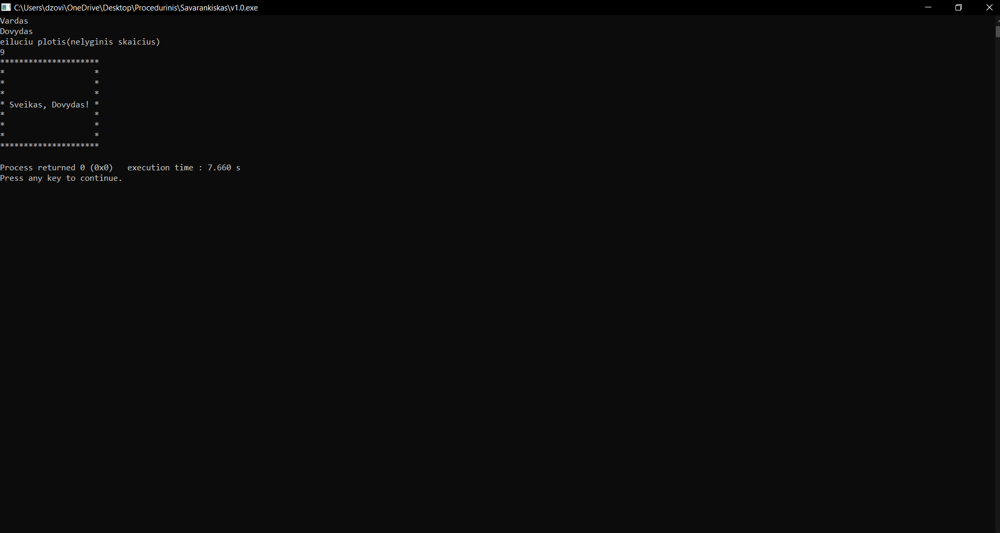

# Pirma-Uzduotis

Ši programa įvedus savo vardą ir eilučių plotį atspausdina tam tikrą eilučių kiekį su žvaigždutėm arba be jų. Atsižvelgia į vardą (ar tai moteriškas ar vyriškas, nuo to priklauso kreipinys "Sveikas, " arba "Sveika, "). Tada pagal eilučių kiekį padaro, kad pasisveikinimas būtų per vidurį.

